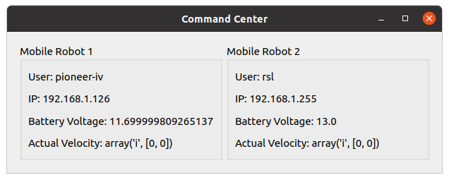

# gui_core

Python program that uses PyQt5 to create a window, generates a frame for each robot currently connected
through WiFi, and dynamically updates each individual status label in near real-time using ROS.

## Current GUI Appearance


## File Description
[main.py](/gui_core/main.py) - Start of program that creates a window.<br>
[connect.py](/gui_core/connect.py) - Methods that involve running bash commands.<br>
[robot.py](/gui_core/robot.py) - Methods that involve the robot such as getting username and IP.<br>
[subscribers/window.py](/gui_core/subscribers/window.py) - ROS subscriber that listens to all relevant topics to display status values in near real-time.<br>

## Installation

Clone the repository:
```
git clone git@github.com:irahulone/gui_core.git
```

## Usage
From local machine:
```commandline
python3 main.py
```

## Notes
In order for metrics to be displayed in near real-time, this program assumes that ROS topics follow the <i>{user}/stat_name</i> format.<br>
User or username is the name of the onboard computer and can be found by running in terminal:
```commandline
echo $USER
```

Example Scenario:
```
Robot 1:
Username = rsl
Display stats: battery voltage, actual velocity

Robot 2:
Username = pioneer-iv
Display stats: battery voltage, actual velocity
_____________________________________________________________________
$ ros2 topic list
rsl/battery_voltage
rsl/velocity
pioneer_iv/battery_voltage
pioneer_iv/velocity
```

### Add more stats to GUI
Add the necessary topic names, message types, and callback functions to __create_subscribers method in
window.py
